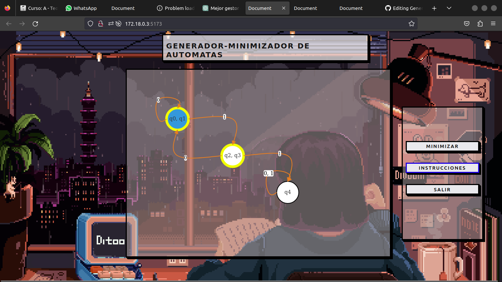

# Generador_Minimizador_AFD
Pagina para crear y minimizar automatas finitos deterministas de forma visual

Instrucciones de uso:  

Click izquierdo para crear un estado.  

Click izquierdo mas Shift para crear un estado inicial.  

Click izquierdo mas Ctrl para crear un estado final.  

Click izquierdo sobre un estado para crear una transicion hacia otro estado.  

Click derecho sobre una transicion para eliminarla.  

Click derecho sobre un estado para eliminarlo. 

# Descarga y uso
La mejor forma de descargar este software es mediante docker.

Solo debes clonar el repositorio y en la ubicacion del mismo ejecutar el comando:

### docker-compose up

Y el programa ya estara corriendo en el host y puerto indicado